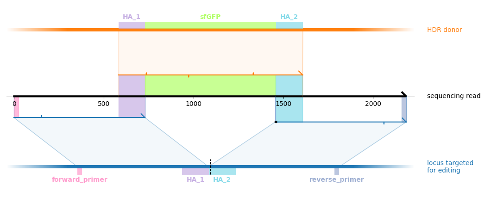
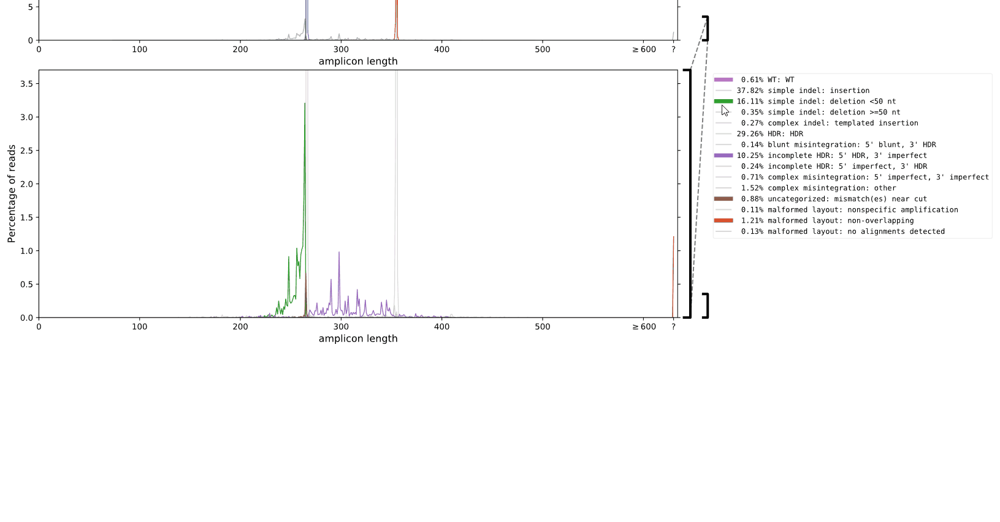

# knock-knock  [](https://badge.fury.io/py/knock-knock) 

`knock-knock` is a tool for exploring, categorizing, and quantifying the sequence outcomes produced by CRISPR knock-in experiments.


## Installation
### conda
Note: conda installation doesn't work yet
```
conda config --add channels bioconda
conda config --add channels conda-forge
conda install knock-knock
```
### pip
```
pip install knock-knock
```

If installing with `pip`, non-Python dependencies need to be installed separately:
- `blastn` (2.7.1)
- `minimap2` (2.16)
- `samtools` (1.9)
- `STAR` (2.7.1)


## About

`knock-knock` tries to identify the different ways that genome editing experiments can produce unintended shufflings and rearrangments of the intended editing outcome.
In order to do this, the strategy used to align sequencing reads makes as few assumptions as possible about how the reads should look.
Instead, it takes each amplicon sequencing read and attempts to produce a comprehensive set of local alignments between portions of the read and all relevant sequences present in the edited cell.
Each read is then categorized by identifying a parsimonious subset of local alignments that cover the whole read and analyzing the architecture of this set of covering alignments. 

`knock-knock` supports Pacbio CCS data for longer (\~thousands of nts) amplicons and paired-end Illumina data for shorter (\~hundreds of nts) amplicons.

## Visualization
`knock-knock` provides a few ways to interactively explore the different types of alignment architectures produced by each experiment. 

### Summary table


### Outcome-stratified amplicon length distributions


## Usage

The first step in using knock-knock is to create a project directory that will hold all input data, references sequences, and analysis output for a given project.

Every time knock-knock is run, this directory is given as a command line argument to tell knock-knock which project to analyze.

Throughout this documentation, `PROJECT_DIR` will be used as a stand-in for the path to an actual project directory.

### Obtaining reference sequences and building indices

Once you have created a project directory, `knock-knock` needs to be provided with the reference genome of a targeted organism in fasta format, and to build indices from this reference.
These files are stored in direcotry called `indices` inside a project directory.

knock-knock provides a built-in way to download references and build indices for human (hg38), mouse (mm10), or e. coli genomes. To do this, run

```knock-knock build_indices PROJECT_DIR ORGANISM [--num_threads NUM_THREADS]```

where ORGANISM is one of hg38, mm10, or e_coli, and NUM_THREADS is an optional argument that can be provided to use multiple threads for index building.
(This can take up to several hours for mammalian-scale genomes.)

### Specifying targets

The next step is to provide information about which genomic location was targeted for editing and the sequence of the donor that was provided (if any).
`knock-knock` refers to the combination of a genomic location and associated homology donor as a *target*.
Information about targets is stored in a directory called `targets` inside a project directory.

Genomic location is specified by providing the name of genome targeted (which must exist in PROJECT_DIR/indices), the protospacer of the (SpCas9) sgRNA that was used for cutting, and the amplicon primers flanking the genomic location of this protospacer that were used to amplify the genomic DNA. 

Targets are defined in a set of csv files inside the `targets` directory. A group of "parts-list" files 'sgRNAs.csv, 'amplicon_primers.csv', 'donors.csv', and 'extra_sequences.csv' are used to register named sequences of each csv's corresponding type, and a master csv file `PROJECT_DIR/targets/targets.csv` defines each target using references to these named sequnences.

A target is defined by filling out a row in `PROJECT_DIR/targets/targets.csv`, which must have the following columns:

- `name`: a short, descriptive name for the target
- `genome`: the name of the genome targeted (which must exist in `PROJECT_DIR/indices`)
- `sgRNA`: name of the protospacer sequence that was cut. knock-knock can analyze data produces by cutting with multiple nearby guides in no-donor mode. If there are multiple guides, include all sgRNA names joined by semicolons.
- `amplicon_primers`: name of the primer pair used to generate the amplicon for sequencing
- `donor`: name of the homology-arm-containing donor, if any
- `nonhomologous_donor`: name of the non-homology-arm containing donor, if any
- `extra_sequences`: name(s) of any extra sequences that may be present, joined by semicolons.

Further details:

The `sgRNA` column of `targets.csv` should reference entries in `sgRNAs.csv`.
Rows of `sgRNAs.csv` define named sgRNA sequences, with columns `name` and `sgRNA_sequence`.
sgRNA sequences should be given as 5' to 3' sequence and not include the PAM.
They must exactly match a sequence in the targeted genome.

As an example, the contents of the `sgRNAs.csv` file included with knock-knock's example data are:
```
name,sgRNA_sequence
BCAP31,GATGGTCCCATGGACAAGA
CLTA,GAACGGATCCAGCTCAGCCA
RAB11A,GGTAGTCGTACTCGTCGTCG
```

The `amplicon_primers` column of `targets.csv` should reference entries in `amplicon_primers.csv`.
Rows of `amplicon_primers.csv` define named amplicon primer pairs, with columns `name` and `primer_sequences`.
Primer sequences should be given as the 5' to 3' sequences of the primer pair (i.e. the two sequences should be on opposite strands) joined by a semicolon.
If a primer pair is used together with an sgRNA, there must exist exact matches to the two primer sequences on opposite sides of the sgRNA sequence somewhere in the targeted genome.

As an example, the contents of the `amplicon_primers.csv` file included with knock-knock's example data are:

```
name,amplicon_primer_sequences
BCAP31_ILL,GCTGTTGTTAGGAGAGAGGGG;GGGAAGCAGAAGGGCACAAA
CLTA_ILL,ACCGGATACACGGGTAGGG;AGCCGGGTCTTCTTCGC
RAB11A_PAC,GCAGTGAAGAAGCTCATTAAGACAAC;GAAGGTAGAGAGAGTTGCCAAATGG
```

The `donor` and `nonhomologous_donor` columns of `targets.csv` should reference entries in `donors.csv`.
Rows of `donors.csv` define named donors, with columns `name`, `donor_type`, and `donor_sequence`.
If a donor is used in the `donor` column of a target definition, its sequence must contain two homology arms that flank the cut site of target's sgRNA. 
Setting `donor_type` to `plasmid` causes knock-knock to be aware that the sequence has a circular topology when processing alignments to it.


As an example, the contents of the `donors.csv` file included with knock-knock's example data are:
```
name,donor_type,donor_sequence
BCAP31_GFP11_U,ssDNA,CTACTGCTGTGGGATTTCTGTCCCTTTCCAGGCTG...
CLTA_GFP11_PCR,PCR,GGGAACCTCTTCTGTAACTCCTTAGCGTCGGTTGGTT...
pML217_RAB11A-150HA,plasmid,agatttatcagcaataaaccagccagcc...
RAB11A-150HA_PCR_donor,PCR,GCCGGAAATGGCGCAGCGGCAGGGAGGGG...
```

with the actual donor sequences truncated for display purposes.


After filling out all target-specification csvs, run 
```
knock-knock build_targets PROJECT_DIR
```
to convert the information you have provided into the form needed for subsequent analysis.

### Sample sheets

Input sequencing data fastqs should be put in a directory called `data` inside the project directory, with each group of experiments (typically from one sequencing run) stored in a further subdirectory (e.g. `PROJECT_DIR/data/EXAMPLE_RUN`).
Each group subdirectory needs a sample sheet to tell knock-knock which target to align each experiment to.
Samples are defined by rows in `sample_sheet.csv`.
The columns of a sample sheet are slightly different for Illumina and Pacbio sequencing runs.
The common columns are:
- `sample`: a short, descriptive name of the sample
- `platform`: `illumina` or `pacbio`
- `target`: the name of the target (which must have been built as described [above](#specifying-targets))
- `supplemental_indices`: the name(s) of full genomes to which reads should be aligned, joined by semicolons. This should typically be the name of the targeted organism, plus e_coli if a plasmid donor produced in e. coli was used. Genome names referenced must exist in `PROJECT_DIR/indices` as described [above](#obtaining-reference-sequences-and-building-indices))
- `color`: an optional 
To provide this, make `sample_sheet.csv` in the group subdirectory with header row `sample,platform,R1,R2,CCS_fastq_fns,target_info,donor`

where:
- sample is the sample name
- platform is 'illumina' or 'pacbio'
- if platform is 'illumina', R1 and R2 are a pair of R1 and R2 fastq file names in the group's directory (not the full path, just the part after the last slash)
- if platform is 'pacbio', CCS_fastq_fns are circular consensus sequence fastq file names (not the full path, just the part after the last slash)
- target_info is the name of an editing target that exists in this project's target directory
- donor is 
- color (optional) is a number you can provide such that all samples with the same number will be given the same color in the html tables


Example directory structure:
```
base_dir
├── data
│   ├── group1
│   │   ├── sample_sheet.yaml
│   │   ├── data1.fastq
│   │   └── data2.fastq
│   └── group1
│       ├── sample_sheet.yaml
│       ├── data1.fastq
│       └── data2.fastq
└── targets
    └── locus_name
        ├── manifest.yaml
        ├── refs.fasta
        ├── refs.fasta.fai
        └── refs.gff
```
Input fastqs and sample sheets describing the experiments that produced them are kept in base_dir/data in 'group' directories.

Each sample_sheet.yaml should contain {experiment names: {description dictionary}} pairs.
Each experiment's description dictionary must always contain the key-value pair:

    target_info: name of the target (see below)

For a PacBio experiment, it should also contain

    fastq_fn: name of the fastq file (relative to the group's directory, i.e. just the basename)

For an illumina experiment, it should contain:
    R1_fn: name of the R1 fastq file (relative to the group's directory, i.e. just the basename)
    R2_fn: name of the R2 fastq file (relative to the group's directory, i.e. just the basename)
    
It can also contain other optional keys describing properties of the experiment, e.g.:
    cell_line: string
    donor_type: string
    replicate: integer
    sorted: boolean

target_info should be the name of a directory in base_dir/targets (e.g. locus_name above) containing descriptions of the sequences used in the experiment.
Nomenclature: 'target' is the genomic locus being targeted, and 'donor' is the exogenous sequence being added.

The required files are:

- a fasta file `refs.fasta` containing the target sequence, donor sequence, and any suspected contaminants

- an index `refs.fasta.fai` of this fasta file

- a gff file `refs.gff` marking various features on these sequences.

    Required features are -
    target: [sgRNA, 5' HA, 3' HA, forward primer, reverse primer]
    donor: [5' HA, 3' HA] (TODO: this is incomplete)

- `manifest.yaml`, with contents

    target: seqname in refs.fasta of target
    donor: seqname in refs.fasta of donor
    sources: list of genbank files from which to generate refs.\*

The fasta, fai, and gff  files can be generated by annotating the target and donor sequences with the required features in benchling, downloading the benchling files in genbank format into the locus_name directory, listing these files in the 'sources' entry in 'manifest.yaml', then running TargetInfo.make_references (TODO: explain).

Once an experiment_name directory containing data and a manifest pointing to a valid target_info directory exists, process the experiment with 
```
knock-knock process BASE_DIR GROUP_NAME EXPERIMENT_NAME
```

If GNU parallel is installed, you can run
```
knock-knock parallel BASE_DIR MAX_PROCS
```
to process all experiments that exist in BASE_DIR in parallel up to MAX_PROCS at a time.

To select only a subset of experiments to process, 
```
knock-knock parallel BASE_DIR MAX_PROCS --condition "yaml here"
```
where the yaml gives conditions that the optional properties of an experiment need to satisify. (TODO: explain)

After experiments have been processed, to generate csv and html tables of outcome counts:
   
```
knock-knock table BASE_DIR
```

To explore outcomes in more depth than the html table, run
```
import knock_knock.visualize
knock_knock.visualize.explore(your_base_dir, by_outcome=True)
```
in a Jupyter notebook.
