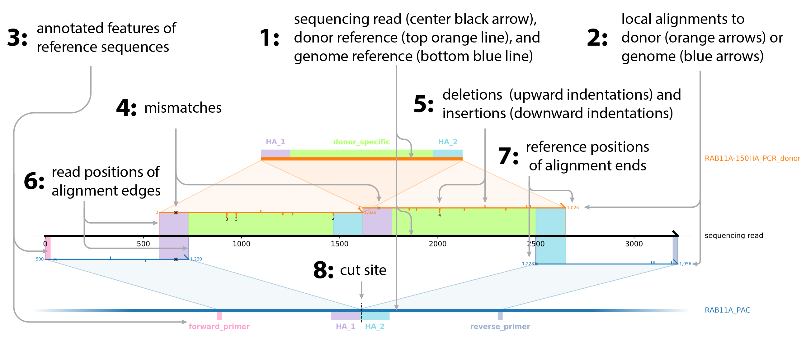
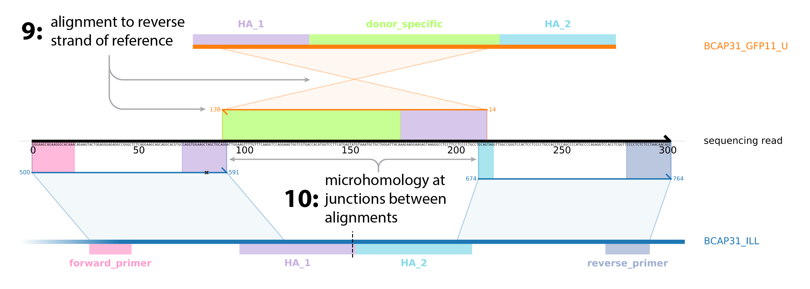
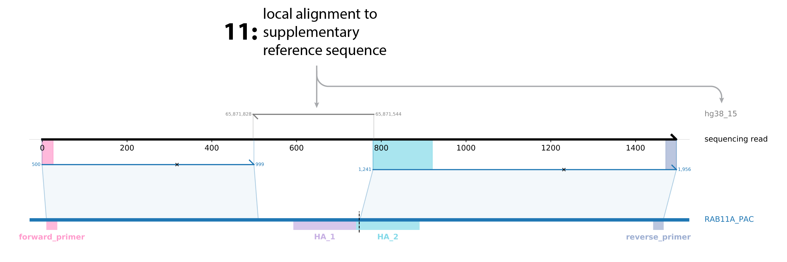
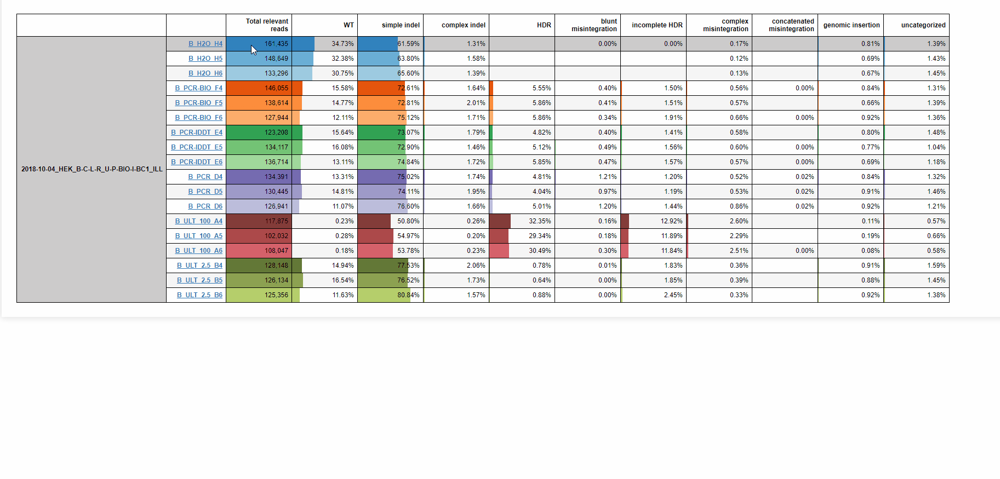
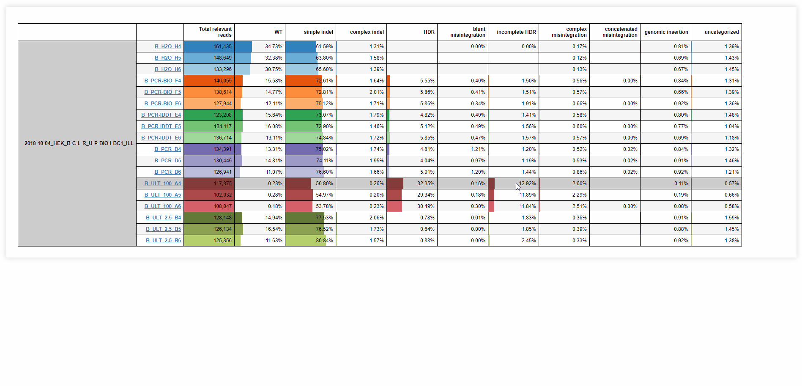
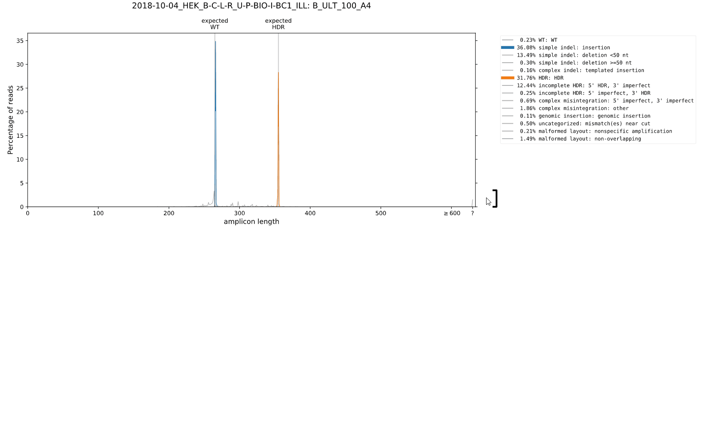
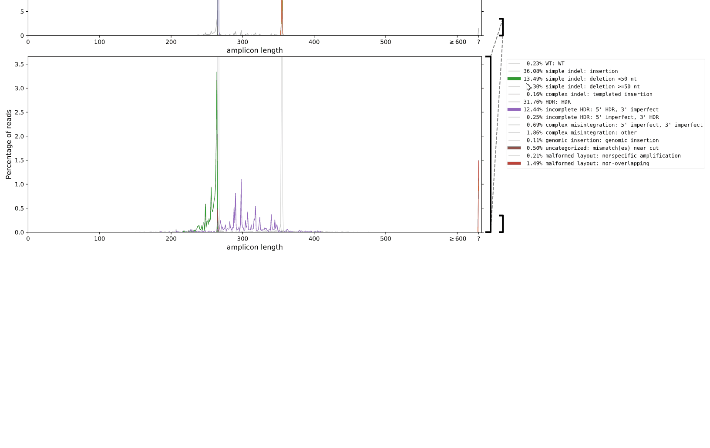

# Alignment diagrams

knock-knock's output is centered around diagrams representing the architecture of local alignments that make up each amplicon sequencing read, like this:

This particular diagram shows a Pacbio sequencing read of an editing outcome in which the genomic locus has been modified by knock-in of two concatenated copies of the intended PCR-product HDR donor, with a clean handoff from genomic sequence to donor sequence at homology arms on each side of the cut.
To understand how this diagram represents this information, here is the same diagram again with some overlaid explanations:

1. The black arrow in the center of a diagram represents a sequencing read of a single editing outcome.
The thick orange line on top represents the sequence of an HDR donor, and the thick blue line on bottom represents the targeted genome in the vicinity of the cut site.
1. Arrows represent local alignments between part of the sequencing read and part of a reference sequence.
The horizontal extent of each arrow marks the aligned portion of the sequencing read, and a parallelogram connects to the corresponding aligned region of a reference sequence.
1. Annotated features on reference sequences are marked with colored rectangles and labeled by name.
Rectangles of the same colors connect sections of alignments that overlap features to corresponding sections of the sequencing read.
1. Mismatches are marked with crosses.
Crosses at low-quality read positions are faded.
1. Deletions are marked by upward indentations and insertions by downward indentations (1 nt long if unlabeled, otherwise labeled with length).
1. Vertical lines connect edges of alignments to their position on the sequencing read.
1. Numbers next to alignment ends indicate position in relevant reference sequence.
1. The cut site is marked by a vertical dashed line.
    
Here is a different diagram, this time of an Illumina sequencing read of an editing outcome in which a portion of an ssDNA HDR donor has been inserted at the cut site in the opposite orientation of the intended outcome:

9. If an alignment is to the reverse strand of a reference sequence, its arrowhead points left instead of right, and the lines connecting to the reference cross each other. 
1. When two alignments overlap (that is, both cover the same part of the sequencing read) at the junction between them, this indicates that there is a stretch of microhomology between the relevant parts of the two reference sequences. 

In another Pacbio read, a stretch of human genomic DNA not originating from the immediate vicinity of the cut site has been integrated.

11. Alignments to reference sequences that aren't the donor sequence or the immediate vicinity of the cut site are represented by grey arrows, with the name of the reference sequence annotated on the far right (in this case, chromosome 15 of the hg38 genome assembly).

# Interactive exploration of outcomes

## Tables

knock-knock generates interactive tables of outcomes frequencies showing how often each different outcome category (column) was observed in each experimental sample (row).
Hover over the percentage in a cell pops up a diagram to see an example of that outcome category in that sample.

Hover over numbers in the 'Total relevant reads' column to see the distribution of amplicon read lengths in each sample.

Clicking on the percentage in a cell to brings up a window with more information about occurences of that outcome in that sample.
At the top of the window, a plot shows how the distribution of amplicon lengths for that outcome compare to all other reads in the sample.
Scroll down to see diagrams of more example reads.
Click outside the window or press Esc to return to the main table.

Click the name of a sample to open an [outcome browser](#Browser) for that sample in a new tab.

## Browser

Click a bracket to open a new panel zooming in on that frequency range. Clicking an already-open bracket closes it (and all panels below it).

Click the colored line next to an outcome category in the legend to focus on the category.
This will highlight that outcome in the plot and make it so that hovering over lengths at which that outcome is observed pops up a diagram with an example of that outcome at that length.

Although knock-knock was designed to analyze knock-in experiments, it can also be useful for exploring editing outcomes in other settings.
As an example, here is data from an experiment in which a gene was cut with three guides within a few hundred nts of each other (vertical dashed lines in the single example outcome below) to drive efficient disruption of gene function by producing excision of the sequence between the cuts.
The 

Exploring the distribution of amplicon lengths produced by this strategy reveals three major peaks consisting of exicsion between the first and second, second and third, or first and third cut sites.
Tails of slightly shorter outcomes off of each peak consist of outcomes in which an excisions between two cuts is accompanied by a deletion at the remaining cut.

